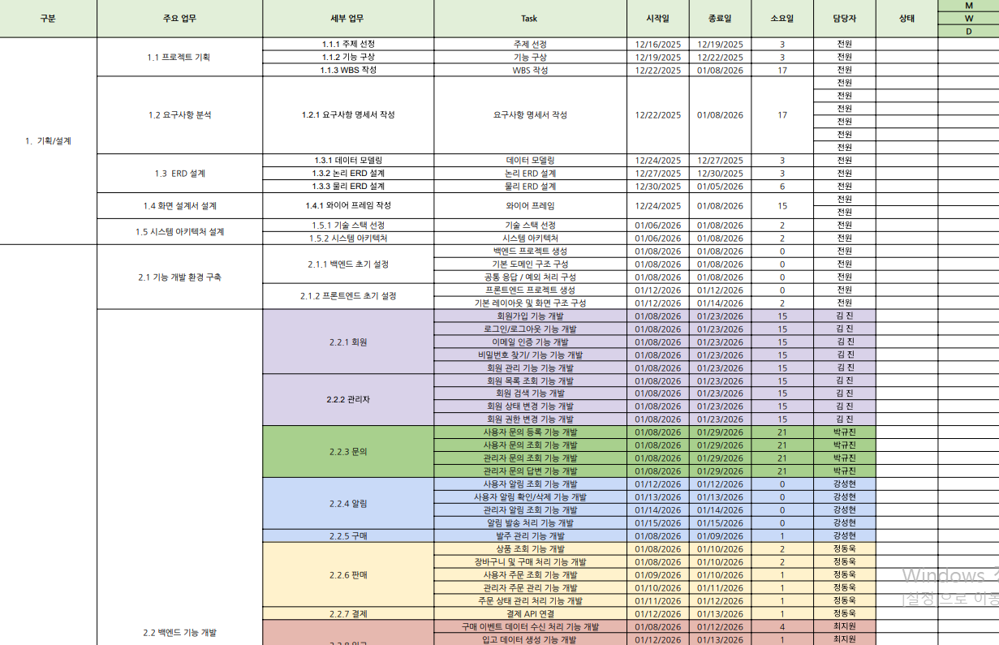
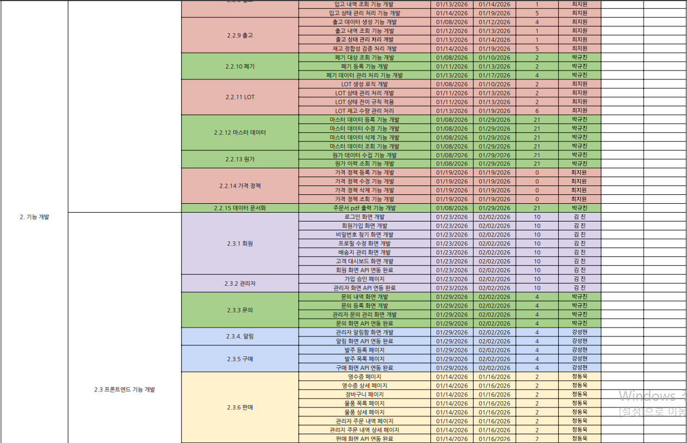
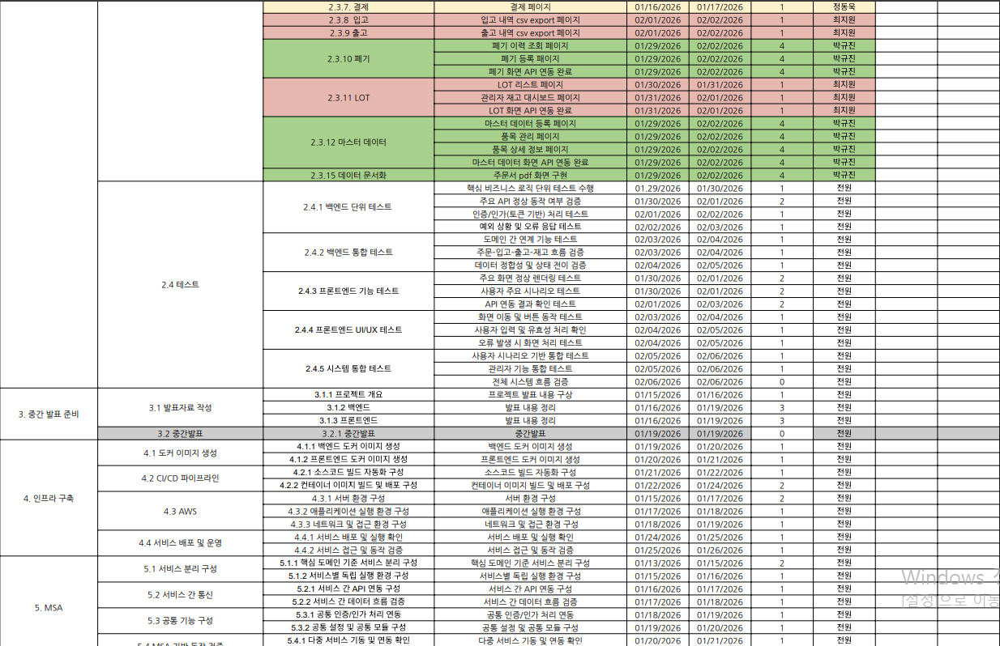
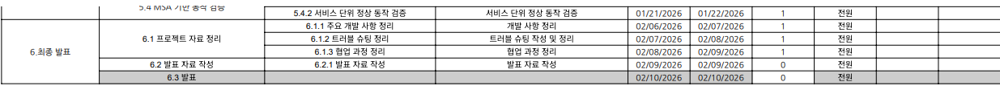
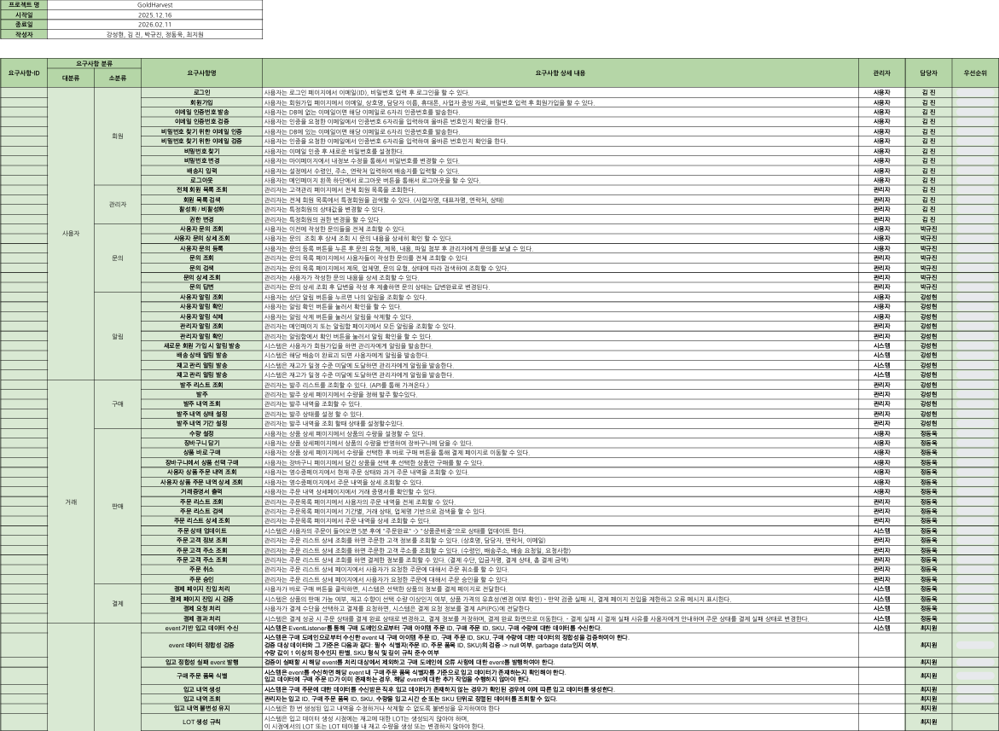
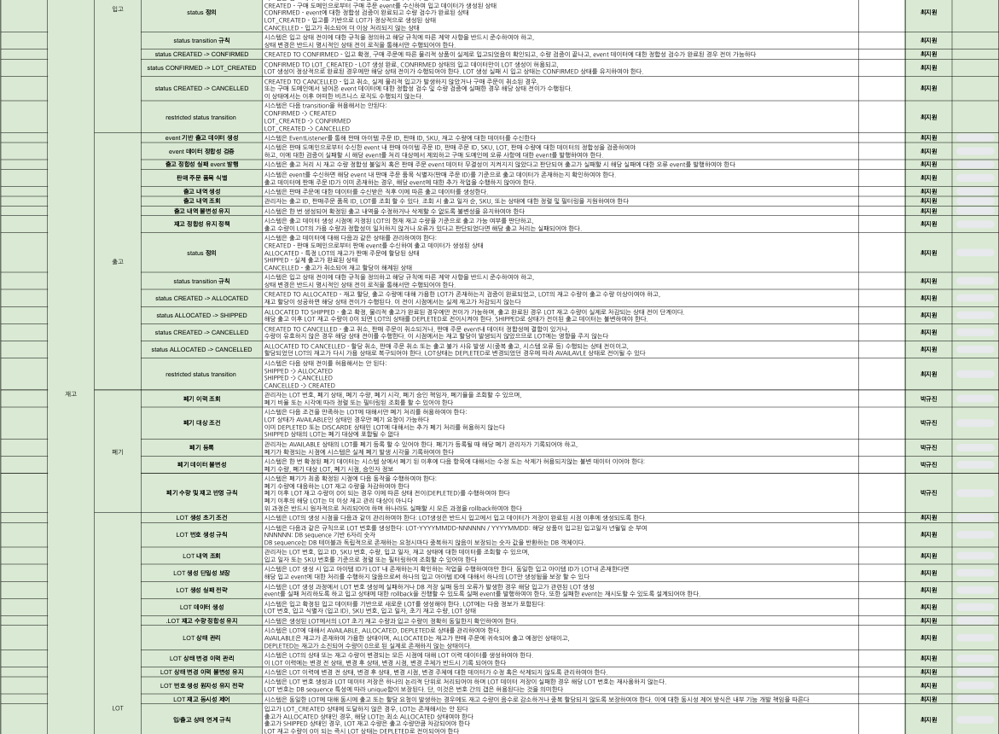
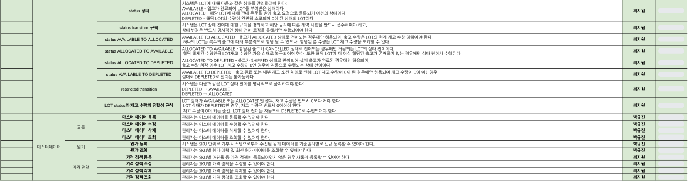
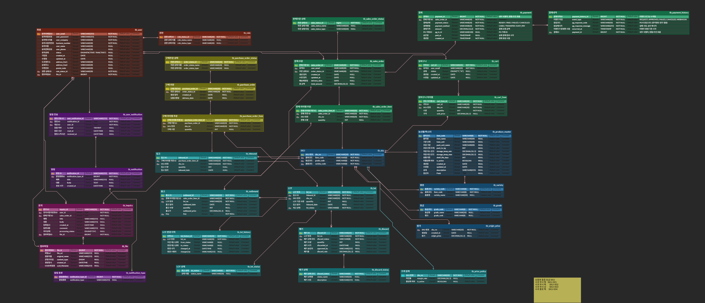
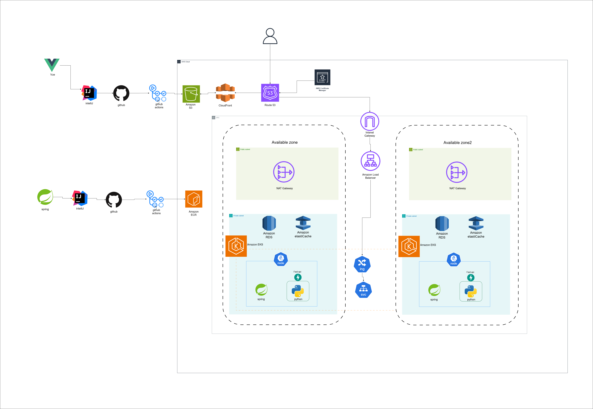

# 🪙 **Golden**

## 👤 **1. 팀원 소개**

<table style="width: 100%; text-align: center;">
<tr>
<td align="center"> <a href="https://github.com/okok02110211">강성현</a></td>
<td align="center"> <a href="https://github.com/steamjin">김 진</a></td>
<td align="center"> <a href="https://github.com/KyujinPark01">박규진</a></td>
<td align="center"> <a href="https://github.com/Zane-Jeong">정동욱</a></td>
<td align="center"> <a href="https://github.com/405supply">최지원</a></td>
</tr>
<tr>
<td align="center">
    
</td>
<td align="center">
    
</td>
<td align="center">
    
</td>
<td align="center">
    
</td>
<td align="center">
    

</td>
</tr>
</table>

## 📖 **2. 프로젝트 개요**

[프로젝트 기획서](https://docs.google.com/document/d/1v7wiuOBeu2GY7eWCEXlaqo3bHUNFWnCKDQfKgXnpFAI/edit?tab=t.0)에서 확인하실 수 있습니다.

## 🕹️ **3. 개발 환경 및 기술 스택**

### 💾 Database & Cache

    
    
    

### ⚙️ Backend

  
  
  
  
  
  

### 🎨 Frontend

     
   
  
  
    

### ☁️ Infrastructure / DevOps

    
    
    
    

### 📝 Design & Documentation

    
    
     

### 🤝  Collaboration

## 📁 **4. 프로젝트 구조**

### Backend 폴더 구조

### Frontend 폴더 구조

## 📅 **5. 프로젝트 기획**

### 1. **WBS**

 

 WBS 이미지

 

### 2. **요구사항 명세서**

 

 요구사항 명세서 이미지

 

### 3. **ERD**

 

 ERD 이미지

 

### 4. **API 명세서**

### 5. **FIGMA**
[FIGMA 바로가기](https://www.figma.com/design/C76lMTHuExvnOCFg2q12LU/GoldenHarvest?node-id=0-1&p=f&t=dC1Wz7BUplinmjtQ-0)에서 확인하실 수 있습니다.

 

## ⏳ **6. 사용자 흐름 **

### **API GIF**

### **GUIDE URL**

## ⚙️ **7. 아키텍쳐**

 

 아키텍쳐

## ⚠️ **8. 트러블 슈팅**
